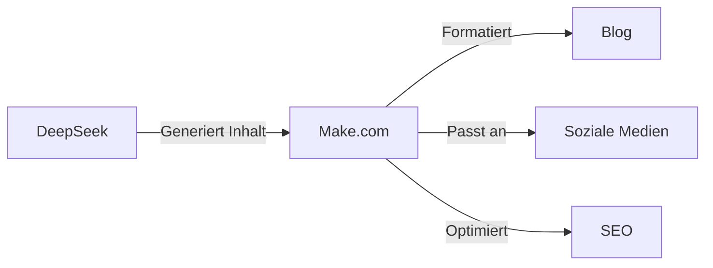

## Einführung

Bevor KI so weit fortgeschritten ist, dass sie uns die ganze Arbeit abnimmt, wird sie zunächst denen von uns, die lernen wollen, Superkräfte verleihen 

Mit den richtigen Werkzeugen kann eine einzelne Person erreichen, was früher ein ganzes Team erforderte!


**Was Sie gewinnen:**
- Automatisierung wiederholter Aufgaben 
- Steigerung der Produktivität 
- Kostensenkung 

**Was Sie brauchen:**
- DeepSeek R1 - Geringe API-Kosten
- Make.com - Kostenloser Plan für den Anfang
- VSCode + Cline - Kostenlos

In diesem Artikel zeige ich, wie man die Kraft dieser Werkzeuge kombiniert, um ein eigenes Automatisierungs-Ökosystem zu schaffen.

## DeepSeek: Effizienter Assistent

### Was ist DeepSeek?

DeepSeek ist ein fortschrittliches KI-Modell, das am 20. Januar 2025 die bahnbrechende Version R1 veröffentlichte und die Möglichkeiten der Automatisierung und Programmierung revolutionierte. DeepSeek-R1 bietet:

- Leistung, die OpenAI-o1 in Denkaufgaben entspricht oder übertrifft
- 671B Parameter (37B aktiv) mit MoE-Architektur (Mixture of Experts)
- Außergewöhnliche Programmierfähigkeiten (96.3 Perzentil in Codeforces)
- Fortgeschrittene mathematische Fähigkeiten (79.8% in AIME 2024, besser als OpenAI o1-1217)
- Vollständig Open-Source-Modell mit MIT-Lizenz für kommerzielle Nutzung

Was DeepSeek-R1 von anderen KI-Modellen unterscheidet, sind vor allem seine fortgeschrittenen Denk- und Analysefähigkeiten, die kommerziellen Closed-Source-Modellen entsprechen oder sie übertreffen. Das Modell verwendet die fortschrittlichste MoE-Architektur, die eine viel bessere Leistung bei angemessenen Implementierungskosten ermöglicht.

Die Kosten für die Nutzung von DeepSeek R1 betragen nur $2,19 pro Million Ausgabe-Tokens, verglichen mit $60 pro Million Tokens beim Modell o1.

### Anwendungen von DeepSeek

1. **Code- und Inhaltsgenerierung**
   - Textgenerierung
   - Erstellung kompletter Funktionen und Module
   - Automatische Generierung von Unit-Tests
   - Refaktorisierung bestehenden Codes

2. **Debugging und Optimierung**
   - Fehleranalyse im Code
   - Vorschläge zur Leistungsoptimierung
   - Identifizierung potenzieller Sicherheitsprobleme

3. **Dokumentation und Erklärungen**
   - Automatische Dokumentationsgenerierung
   - Detaillierte Erklärungen der Codefunktionalität
   - Erstellung von Anwendungsbeispielen

## Make.com: Zentrum der Automatisierung

### Grundlagen von Make.com

Make.com (ehemals Integromat) ist eine leistungsstarke No-Code-Plattform zur Prozessautomatisierung. Es bietet:

- Intuitive Drag-and-Drop-Oberfläche
- Über 1500 vorgefertigte Integrationen
- Fortgeschrittene Datenverarbeitungsmöglichkeiten
- Integration mit KI-Tools

### Schlüsselfunktionen der Automatisierung

1. **Workflows**
   - Visuelle Erstellung von Automatisierungen
   - Bedingte Ausführung von Aufgaben
   - Handhabung komplexer Geschäftsszenarien

2. **KI-Integrationen**
   - Verbindung mit Sprachmodellen
   - Automatische Text- und Bildverarbeitung
   - Sentiment-Analyse und Datenklassifizierung

3. **Datenmanagement**
   - Automatische Synchronisierung zwischen Systemen
   - Datenumwandlung und -validierung
   - Erstellung von Backups

### 1. Inhaltsveröffentlichungssystem



**Implementierung:**
1. Verwenden Sie DeepSeek zur Erstellung von Initialinhalten
2. Konfigurieren Sie den Workflow in Make.com:
   - Automatische Textformatierung
   - Hinzufügen von Bildern und Metadaten
   - Veröffentlichung auf verschiedenen Plattformen
3. Überwachen Sie die Ergebnisse und passen Sie den Prozess an

### 2. Automatische Erstellung von Seiten und Anwendungen


Schritt für Schritt, von der Installation bis zur vollautomatisierten Anwendung.



**Profi-Tipp:** Bei Problemen mit Installation, Verständnis oder Nutzung fragen Sie kostenlos im DeepSeek-Chat


#### Schritt 1: Umgebung einrichten

**Installation der Werkzeuge** 

- Laden Sie Visual Studio Code herunter und installieren Sie es
- Installieren Sie die Cline-Erweiterung aus dem Marketplace

**Konfiguration von DeepSeek R1** 

1. Öffnen Sie VSCode
2. Drücken Sie Strg+Umschalt+P
3. Geben Sie ein: Cline: Open Settings
4. Wählen Sie DeepSeek R1 als Modell
5. Fügen Sie Ihren API-Code ein

#### Schritt 2: Erstellung einer Webseite

1. Erstellen Sie einen neuen Projektordner in VSCode
2. Schreiben Sie in Cline: "Erstellen Sie eine responsive Landingpage für ein Unternehmen [Beschreibung]"
3. DeepSeek R1 generiert die Dateistruktur:
   ```
   project/
   ├── index.html
   ├── styles.css
   ├── main.js
   └── assets/
   ```

#### Schritt 3: Automatisierung mit Make.com

1. Erstellen Sie ein neues Szenario in Make.com, das als automatischer Wächter Ihres Projekts fungiert:

   **Schritt 1: Änderungsüberwachung** 🔍
   - Fügen Sie das Modul "Watch Folder" hinzu
   - Geben Sie Ihren Projektordner an
   - Legen Sie die Überprüfungshäufigkeit fest (z.B. alle 15 Minuten)

   **Schritt 2: Automatische Bereitstellung** 🚀
   - Wenn eine neue oder geänderte Datei erscheint
   - Make.com sendet die Änderungen automatisch an das Hosting
   - Sie können Netlify, Vercel oder GitHub Pages wählen

   **Schritt 3: Benachrichtigungen** 📱
   - Nach erfolgreicher Bereitstellung
   - Senden Sie eine Nachricht an Slack oder E-Mail
   - Enthalten Sie Informationen über die vorgenommenen Änderungen

💡 **Tipp:** Sie können Bedingungen hinzufügen, z.B. stellen Sie nur bereit, wenn eine HTML- oder CSS-Datei geändert wurde

#### Schritt 4: Entwicklung von Funktionen

1. In Cline können Sie anfordern, neue Funktionen hinzuzufügen:
   - "Fügen Sie ein Kontaktformular mit Validierung hinzu"
   - "Optimieren Sie die Leistung der Seite"
   - "Fügen Sie Scroll-Animationen hinzu"

2. DeepSeek R1 generiert den entsprechenden Code, den Sie direkt implementieren können. Für einfachere Aufgaben können Sie in Cline zu DeepSeek-Chat wechseln, der kostengünstiger, aber auch intelligent ist.

#### Schritt 5: Integration mit APIs

1. Verwenden Sie Make.com, um sich mit externen Diensten zu verbinden:
   - Datenbanken
   - Zahlungssysteme
   - Analysetools

#### Tipps für effizientes Arbeiten

- Verwenden Sie Cline-Snippets, um schnell wiederkehrende Elemente zu generieren
- Lassen Sie DeepSeek R1 Codeoptimierungen vorschlagen
- Verwenden Sie Make.com, um Tests und Bereitstellungen zu automatisieren

### Erstellung einer einfachen Geschäftsanwendung

#### Schritt 1: Vorbereitung einer CRM-Anwendung in VSCode

1. Öffnen Sie VSCode mit der Cline-Erweiterung und verwenden Sie den folgenden Prompt:
   ```
   "Erstellen Sie eine einfache CRM-Anwendung mit Webinterface, die Folgendes enthält:
   - Anmeldebereich
   - Kundendatenbank
   - Notizsystem
   - Terminkalender
   Verwenden Sie HTML, JavaScript und Bootstrap für das Frontend."
   ```

2. DeepSeek R1 generiert die Grundstruktur:
   ```
   crm-app/
   ├── index.html          # Anmeldeseite
   ├── dashboard.html      # Hauptbereich
   ├── clients.html        # Kundenverwaltung
   ├── css/
   │   └── style.css      # Anwendungsstile
   ├── js/
   │   ├── main.js        # Hauptlogik
   │   ├── auth.js        # Authentifizierung
   │   └── api.js         # Integrationen
   └── assets/            # Bilder und Symbole
   ```

#### Schritt 2: Prozessautomatisierung mit Make.com

1. Erstellen Sie ein neues Szenario für CRM:
   ```
   Auslöser: "Neuer Kunde hinzugefügt"
   Aktionen:
   1. Speichern Sie Daten in Google Sheets
   2. Erstellen Sie einen Kontakt in Mailchimp
   3. Planen Sie eine Nachverfolgung im Kalender
   4. Senden Sie eine Benachrichtigung an Slack
   ```

#### Schritt 3: Entwicklung von Funktionen mit Cline

1. Fügen Sie neue Funktionen über Prompts hinzu:
   ```
   "Fügen Sie ein E-Mail-Benachrichtigungssystem hinzu für:
   - Neue Leads
   - Geplante Termine
   - Überfällige Aufgaben"
   ```

2. Integration mit externen APIs:
   ```
   "Integrieren Sie die Anwendung mit:
   - Google Kalender API
   - E-Mail-System
   - Zahlungsgateway"
   ```

#### Schritt 4: Optimierung und Bereitstellung

1. Verwenden Sie Make.com zur Automatisierung:
   - Regelmäßige Datensicherungen
   - Automatische Updates
   - Leistungsüberwachung

2. Verwenden Sie DeepSeek R1 zur Optimierung:
   - Codeleistungsverbesserungen
   - Implementierung von Sicherheitsmaßnahmen
   - UI/UX-Anpassungen

#### Tipps:

- Beginnen Sie mit einer kleinen Funktionalität und erweitern Sie schrittweise
- Verwenden Sie Cline für schnelles Prototyping
- Testen Sie jede neue Funktion vor der Implementierung
- Automatisieren Sie wiederkehrende Aufgaben mit Make.com

## Kosten und Optimierung

### Monatliche Kosten eines Beispiel-Setups:

1. **DeepSeek**
   - Chat: $0
   - API: $5-20 je nach Nutzung

2. **Make.com**
   - Kostenloser Plan: 1000 Operationen/Monat
   - Basic-Plan: $9/Monat
   - Pro-Plan: $16/Monat

3. **Zusätzliche kostenlose Werkzeuge**
    - Hosting:
      * GitHub Pages (kostenloses Hosting statischer Seiten)
      * Cloudflare Pages (kostenloser Plan mit CI/CD)
      * Firebase Hosting (kostenloser Plan bis 10GB/Monat)
      * Netlify (kostenloser Plan mit 100GB Datenverkehr)
    - Datenspeicherung:
      * GitHub (bis 500MB pro Repository)
      * Google Drive (15GB kostenlos)
      * Firebase (kostenlose Datenbank bis 1GB)
      * MongoDB Atlas (kostenloser Cluster bis 512MB)

**Gesamtkosten pro Monat:** ab $5 bis $20 (abhängig vom Make.com-Plan und API-Nutzung)

### Kostenoptimierung:

1. Nutzen Sie kostenlose Pläne, wo möglich
2. Automatisieren Sie zeitaufwändige Aufgaben
3. Überwachen Sie die Nutzung und optimieren Sie Workflows

## Best Practices

1. **Planung**
   - Identifizieren Sie wiederkehrende Aufgaben
   - Legen Sie Automatisierungsprioritäten fest
   - Dokumentieren Sie Prozesse

2. **Implementierung**
   - Beginnen Sie mit kleinen, einfachen Automatisierungen
   - Testen Sie jede Komponente gründlich
   - Führen Sie schrittweise Verbesserungen ein

3. **Überwachung**
   - Verfolgen Sie die Effektivität der Automatisierungen
   - Sammeln Sie Fehlerdaten
   - Optimieren Sie basierend auf den Ergebnissen

## Zusammenfassung


Die Kombination von DeepSeek, Make.com und anderen KI-Tools schafft ein leistungsstarkes Automatisierungs-Ökosystem, das für alle zugänglich ist.



Open Source  
Minimale Kosten  
Vollständige Automatisierung 

Das System, das Sie aufbauen werden:

* Automatisiert wiederkehrende Aufgaben 
* Steigert die Produktivität 
* Reduziert Betriebskosten 
* Ermöglicht den Fokus auf strategische Aktionen 

**Tipp:** Beginnen Sie mit kleinen Automatisierungen und erweitern Sie Ihr Ökosystem schrittweise.

## Nützliche Links

**Dokumentation und Ressourcen:** 

- [DeepSeek R1 - Offizielle Dokumentation](https://api-docs.deepseek.com/) 
- [DeepSeek R1 auf HuggingFace](https://huggingface.co/deepseek-ai/DeepSeek-R1) 
- [Make.com-Plattform](https://www.make.com/) 
- [Make.com KI-Zentrum](https://www.make.com/en/ai-automation) 

## Quellen


**Neueste Artikel und Dokumentation:**

1. [Offizielle DeepSeek R1-Dokumentation](https://api-docs.deepseek.com/news/news250120) 20. Januar 2025
2. [Make.com - KI-Automatisierungshandbuch](https://www.make.com/en/ai-automation) 
3. [DeepSeek-Forschungsdokument](https://arxiv.org/abs/2401.14196) 
4. [Make.com-Integrationshandbuch](https://www.make.com/en/integrations) 
5. [DeepSeek-R1: Fortschritt im KI-Denken](https://www.deeplearning.ai/the-batch/deepseek-r1-a-transparent-challenger-to-openai-o1/) Januar 2025
