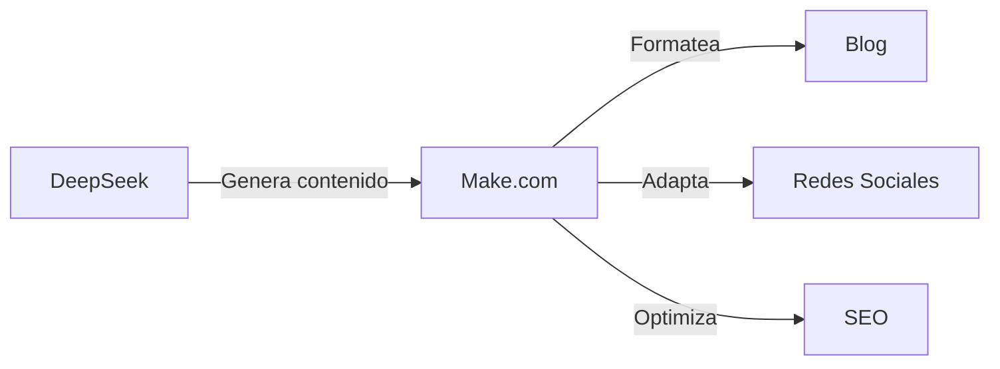

## Introducción

Antes de que la IA madure lo suficiente como para quitarnos todo el trabajo, primero otorgará superpoderes a aquellos de nosotros que quieran aprender 

Usando las herramientas adecuadas, ¡una sola persona puede lograr lo que antes requería un equipo completo!


**Lo que ganarás:**
- Automatización de tareas repetitivas 
- Aumento de la productividad 
- Reducción de costos 

**Lo que necesitas:**
- DeepSeek R1 - Bajo costo de API
- Make.com - Plan Gratis para empezar
- VSCode + Cline - Gratis

En este artículo mostraré cómo combinar el poder de estas herramientas para crear tu propio ecosistema de automatización.

## DeepSeek: Asistente eficiente

### ¿Qué es DeepSeek?

DeepSeek es un modelo avanzado de IA que el 20 de enero de 2025 lanzó la versión revolucionaria R1, transformando las capacidades de automatización y programación. DeepSeek-R1 ofrece:

- Rendimiento igual o superior a OpenAI-o1 en tareas de razonamiento
- 671B parámetros (37B activos) utilizando arquitectura MoE (Mixture of Experts)
- Habilidades excepcionales de programación (percentil 96.3 en Codeforces)
- Capacidades matemáticas avanzadas (79.8% en AIME 2024, mejor que OpenAI o1-1217)
- Modelo completamente open source con licencia MIT que permite uso comercial

Lo que distingue a DeepSeek-R1 de otros modelos de IA es principalmente sus avanzadas capacidades de razonamiento y análisis, que igualan o superan a los modelos comerciales cerrados. El modelo utiliza la arquitectura MoE más avanzada, lo que permite un rendimiento mucho mejor manteniendo costos de implementación razonables.

El costo de usar DeepSeek R1 es de solo $2.19 por millón de tokens de salida, en comparación con $60 por millón de tokens en el caso del modelo o1.

### Aplicaciones de DeepSeek

1. **Generación de código y contenido**
   - Generación de textos
   - Creación de funciones y módulos completos
   - Generación automática de pruebas unitarias
   - Refactorización de código existente

2. **Depuración y optimización**
   - Análisis de errores en el código
   - Sugerencias de optimización de rendimiento
   - Identificación de problemas potenciales de seguridad

3. **Documentación y explicaciones**
   - Generación automática de documentación
   - Explicaciones detalladas del funcionamiento del código
   - Creación de ejemplos de uso

## Make.com: Centro de automatización

### Conceptos básicos de Make.com

Make.com (anteriormente Integromat) es una potente plataforma no-code para la automatización de procesos. Ofrece:

- Interfaz intuitiva de arrastrar y soltar
- Más de 1500 integraciones listas para usar
- Capacidades avanzadas de procesamiento de datos
- Integración con herramientas de IA

### Funciones clave de automatización

1. **Flujos de trabajo (Workflows)**
   - Creación visual de automatizaciones
   - Ejecución condicional de tareas
   - Manejo de escenarios comerciales complejos

2. **Integraciones con IA**
   - Conexión con modelos de lenguaje
   - Procesamiento automático de texto e imágenes
   - Análisis de sentimientos y clasificación de datos

3. **Gestión de datos**
   - Sincronización automática entre sistemas
   - Transformación y validación de datos
   - Creación de copias de seguridad

### 1. Sistema de Publicación de Contenido



**Implementación:**
1. Utiliza DeepSeek para generar contenido inicial
2. Configura el flujo en Make.com:
   - Formateo automático de texto
   - Adición de imágenes y metadatos
   - Publicación en diferentes plataformas
3. Monitorea los resultados y ajusta el proceso

### 2. Creación Automática de Páginas y Aplicaciones


Paso a paso, desde la instalación hasta la aplicación en funcionamiento con automatización completa.



**Consejo profesional:** Cuando tengas problemas con la instalación, comprensión o uso, pregunta gratis en deepseek chat


#### Paso 1: Configuración del entorno

**Instalación de herramientas** 

- Descarga e instala Visual Studio Code
- Instala la extensión Cline desde el marketplace

**Configuración de DeepSeek R1** 

1. Abre VSCode
2. Presiona Ctrl+Shift+P
3. Escribe: Cline: Open Settings
4. Selecciona DeepSeek R1 como modelo
5. Pega tu código API

#### Paso 2: Creación de una página web

1. Crea una nueva carpeta de proyecto en VSCode
2. En Cline escribe: "Crea una página de inicio responsiva para una empresa [descripción]"
3. DeepSeek R1 generará la estructura de archivos:
   ```
   project/
   ├── index.html
   ├── styles.css
   ├── main.js
   └── assets/
   ```

#### Paso 3: Automatización con Make.com

1. Crea un nuevo escenario en Make.com que actuará como guardián automático de tu proyecto:

   **Paso 1: Monitoreo de cambios** 🔍
   - Añade el módulo "Watch Folder"
   - Especifica la carpeta de tu proyecto
   - Establece la frecuencia de verificación (por ejemplo, cada 15 minutos)

   **Paso 2: Implementación automática** 🚀
   - Cuando aparezca un archivo nuevo o modificado
   - Make.com envía automáticamente los cambios al hosting
   - Puedes elegir Netlify, Vercel o GitHub Pages

   **Paso 3: Notificaciones** 📱
   - Después de una implementación exitosa
   - Envía un mensaje a Slack o correo electrónico
   - Incluye información sobre los cambios realizados

💡 **Consejo:** Puedes añadir condiciones, por ejemplo, implementa solo si cambió un archivo HTML o CSS

#### Paso 4: Desarrollo de funcionalidades

1. En Cline puedes solicitar añadir nuevas funciones:
   - "Añade un formulario de contacto con validación"
   - "Optimiza el rendimiento de la página"
   - "Añade animaciones al desplazarse"

2. DeepSeek R1 generará el código correspondiente que puedes implementar directamente. Para tareas más simples puedes cambiar a deepseek-chat en Cline, que es más económico pero también inteligente.

#### Paso 5: Integración con API

1. Usa Make.com para conectarte con servicios externos:
   - Bases de datos
   - Sistemas de pago
   - Herramientas analíticas

#### Consejos para un trabajo eficiente

- Usa snippets de Cline para generar rápidamente elementos repetitivos
- Permite que DeepSeek R1 sugiera optimizaciones de código
- Utiliza Make.com para automatizar pruebas e implementaciones

### Creación de una Aplicación Empresarial Simple

#### Paso 1: Preparación de una aplicación CRM en VSCode

1. Abre VSCode con la extensión Cline y usa el siguiente prompt:
   ```
   "Crea una aplicación CRM simple con interfaz web que incluya:
   - Panel de inicio de sesión
   - Base de datos de clientes
   - Sistema de notas
   - Calendario de reuniones
   Usa HTML, JavaScript y Bootstrap para el frontend."
   ```

2. DeepSeek R1 generará la estructura básica:
   ```
   crm-app/
   ├── index.html          # Página de inicio de sesión
   ├── dashboard.html      # Panel principal
   ├── clients.html        # Gestión de clientes
   ├── css/
   │   └── style.css      # Estilos de la aplicación
   ├── js/
   │   ├── main.js        # Lógica principal
   │   ├── auth.js        # Autenticación
   │   └── api.js         # Integraciones
   └── assets/            # Imágenes e iconos
   ```

#### Paso 2: Automatización de procesos en Make.com

1. Crea un nuevo escenario para CRM:
   ```
   Disparador: "Nuevo cliente añadido"
   Acciones:
   1. Guarda datos en Google Sheets
   2. Crea contacto en Mailchimp
   3. Programa seguimiento en el calendario
   4. Envía notificación a Slack
   ```

#### Paso 3: Desarrollo de funcionalidades con Cline

1. Añade nuevas funciones mediante prompts:
   ```
   "Añade un sistema de notificaciones por correo para:
   - Nuevos leads
   - Reuniones programadas
   - Tareas vencidas"
   ```

2. Integración con API externas:
   ```
   "Integra la aplicación con:
   - API de Calendario de Google
   - Sistema de correo
   - Pasarela de pagos"
   ```

#### Paso 4: Optimización e implementación

1. Usa Make.com para automatizar:
   - Copias de seguridad periódicas de datos
   - Actualizaciones automáticas
   - Monitoreo de rendimiento

2. Utiliza DeepSeek R1 para optimizar:
   - Mejoras en el rendimiento del código
   - Implementación de seguridad
   - Ajustes de UI/UX

#### Consejos:

- Comienza con una funcionalidad pequeña y amplía gradualmente
- Usa Cline para prototipado rápido
- Prueba cada nueva función antes de implementarla
- Automatiza tareas repetitivas con Make.com

## Costos y optimización

### Costos mensuales de un setup de ejemplo:

1. **DeepSeek**
   - Chat: $0
   - API: $5-20 dependiendo del uso

2. **Make.com**
   - Plan Gratis: 1000 operaciones/mes
   - Plan Básico: $9/mes
   - Plan Pro: $16/mes

3. **Herramientas adicionales gratuitas**
    - Hosting:
      * GitHub Pages (hosting gratuito de páginas estáticas)
      * Cloudflare Pages (plan gratuito con CI/CD)
      * Firebase Hosting (plan gratuito hasta 10GB/mes)
      * Netlify (plan gratuito con 100GB de transferencia)
    - Almacenamiento de datos:
      * GitHub (hasta 500MB por repositorio)
      * Google Drive (15GB gratis)
      * Firebase (base de datos gratuita hasta 1GB)
      * MongoDB Atlas (cluster gratuito hasta 512MB)

**Costo total mensual:** desde $5 hasta $20 (dependiendo del plan de Make.com y uso de API)

### Optimización de costos:

1. Utiliza planes gratuitos donde sea posible
2. Automatiza las tareas que consumen más tiempo
3. Monitorea el uso y optimiza los flujos de trabajo

## Mejores prácticas

1. **Planificación**
   - Identifica tareas repetitivas
   - Establece prioridades de automatización
   - Documenta procesos

2. **Implementación**
   - Comienza con automatizaciones pequeñas y simples
   - Prueba a fondo cada componente
   - Introduce mejoras graduales

3. **Monitoreo**
   - Sigue la efectividad de las automatizaciones
   - Recopila datos de errores
   - Optimiza basado en resultados

## Resumen


La combinación de DeepSeek, Make.com y otras herramientas de IA crea un poderoso ecosistema de automatización accesible para todos.



Open Source  
Costos Mínimos  
Automatización Completa 

El sistema que construirás:

* Automatiza tareas repetitivas 
* Aumenta la productividad 
* Reduce costos operativos 
* Permite enfocarse en acciones estratégicas 

**Consejo:** Comienza con pequeñas automatizaciones y amplía gradualmente tu ecosistema.

## Enlaces útiles

**Documentación y recursos:** 

- [DeepSeek R1 - Documentación oficial](https://api-docs.deepseek.com/) 
- [DeepSeek R1 en HuggingFace](https://huggingface.co/deepseek-ai/DeepSeek-R1) 
- [Plataforma Make.com](https://www.make.com/) 
- [Centro de IA Make.com](https://www.make.com/en/ai-automation) 

## Fuentes


**Artículos y documentación más recientes:**

1. [Documentación oficial de DeepSeek R1](https://api-docs.deepseek.com/news/news250120) 20 de enero de 2025
2. [Make.com - Guía de Automatización con IA](https://www.make.com/en/ai-automation) 
3. [Documento de investigación de DeepSeek](https://arxiv.org/abs/2401.14196) 
4. [Guía de integración de Make.com](https://www.make.com/en/integrations) 
5. [DeepSeek-R1: Avance en el razonamiento de IA](https://www.deeplearning.ai/the-batch/deepseek-r1-a-transparent-challenger-to-openai-o1/) enero 2025
