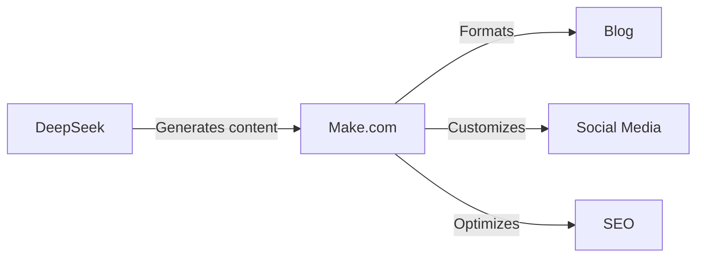

## Introduction


Before AI matures enough to take all our jobs, it will first grant superpowers to those of us who want to learn 


Using the right tools, a single person can achieve what once required an entire team!


**What you'll gain:**
- Automation of repetitive tasks 
- Increased productivity 
- Cost reduction 


**What you need:**
- DeepSeek R1 - Low API cost
- Make.com - Free Plan to start
- VSCode + Cline - Free


In this article, I'll show you how to combine the power of these tools to create your own automation ecosystem.


## DeepSeek: Powerful Assistant

### What is DeepSeek?

DeepSeek is an advanced AI model that released a breakthrough R1 version on January 20, 2025, revolutionizing automation and programming capabilities. DeepSeek-R1 offers:

- Performance matching or exceeding OpenAI-o1 in reasoning tasks
- 671B parameters (37B active) utilizing MoE (Mixture of Experts) architecture
- Exceptional programming abilities (96.3 percentile on Codeforces)
- Advanced mathematical capabilities (79.8% in AIME 2024, better than OpenAI o1-1217)
- Fully open-source model with MIT license allowing commercial use

What sets DeepSeek-R1 apart from other AI models? Primarily its advanced reasoning and analysis capabilities that match or exceed closed commercial models. The model uses state-of-the-art MoE architecture, enabling significantly better performance while maintaining reasonable deployment costs.

```
The cost of using DeepSeek R1 is just $2.19 per million output tokens, 
compared to $60 per million tokens for the o1 model.
```
### DeepSeek Applications

1. **Code and Content Generation**
   - Text generation
   - Complete function and module creation
   - Automatic unit test generation
   - Existing code refactoring

2. **Debugging and Optimization**
   - Code error analysis
   - Performance optimization suggestions
   - Security issue identification

3. **Documentation and Explanations**
   - Automatic documentation generation
   - Detailed code explanations
   - Usage example creation

## Make.com: Automation Hub

### Make.com Basics

Make.com (formerly Integromat) is a powerful no-code platform for process automation. It offers:

- Intuitive drag-and-drop interface
- Over 1500 ready integrations
- Advanced data processing capabilities
- AI tool integration

### Key Automation Features

1. **Workflows**
   - Visual automation creation
   - Conditional task execution
   - Complex business scenario handling

2. **AI Integrations**
   - Connection with language models
   - Automatic text and image processing
   - Sentiment analysis and data classification

3. **Data Management**
   - Automatic system synchronization
   - Data transformation and validation
   - Backup creation


### 1. Content Publication System



**Implementation:**
1. Use DeepSeek for initial content generation
2. Configure Make.com workflow:
   - Automatic text formatting
   - Adding images and metadata
   - Publishing on various platforms
3. Monitor results and adjust process

### 2. Automatic Website and Application Creation


Step by step, from installation to a working application with full automation.



**Pro tip:** When you have installation, understanding, or usage issues - ask deepseek chat for free


#### Step 1: Environment Setup


**Tool Installation** 

- Download and install Visual Studio Code
- Install Cline extension from marketplace


**DeepSeek R1 Configuration** 

1. Open VSCode
2. Press Ctrl+Shift+P
3. Type: Cline: Open Settings
4. Select DeepSeek R1 as model
5. Paste your API code


#### Step 2: Website Creation

1. Create new project folder in VSCode
2. In Cline write: "Create a responsive landing page for [description] company"
3. DeepSeek R1 will generate file structure:
   ```
   project/
   ├── index.html
   ├── styles.css
   ├── main.js
   └── assets/
   ```

#### Step 3: Automation with Make.com

1. Create a new scenario in Make.com that will act as your project's automatic guardian:

   **Step 1: Change Monitoring** 🔍
   - Add "Watch Folder" module
   - Point to your project folder
   - Set check frequency (e.g., every 15 minutes)

   **Step 2: Automatic Deployment** 🚀
   - When new or modified file appears
   - Make.com automatically pushes changes to hosting
   - You can choose Netlify, Vercel, or GitHub Pages

   **Step 3: Notifications** 📱
   - After successful deployment
   - Sends message to Slack or email
   - Includes information about changes made

💡 **Tip:** You can add conditions, e.g., deploy only when HTML or CSS file changed

#### Step 4: Functionality Development

1. In Cline you can request new features:
   - "Add contact form with validation"
   - "Optimize page performance"
   - "Add scroll animations"


2. DeepSeek R1 will generate appropriate code that you can directly deploy. For simpler tasks, you can switch to the cheaper but also smart deepseek-chat in Cline.

#### Step 5: API Integration

1. Use Make.com to connect with external services:
   - Databases
   - Payment systems
   - Analytics tools

#### Tips for Effective Work

- Use Cline snippets for quick generation of repetitive elements
- Let DeepSeek R1 suggest code optimizations
- Use Make.com for test and deployment automation

### Creating a Simple Business Application

#### Step 1: Preparing CRM Application in VSCode

1. Open VSCode with Cline extension and use the following prompt:
   ```
   "Create a simple CRM application with web interface that will include:
   - Login panel
   - Customer database
   - Notes system
   - Meeting calendar
   Use HTML, JavaScript and Bootstrap for frontend."
   ```

2. DeepSeek R1 will generate basic structure:
   ```
   crm-app/
   ├── index.html          # Login page
   ├── dashboard.html      # Main panel
   ├── clients.html        # Client management
   ├── css/
   │   └── style.css      # Application styles
   ├── js/
   │   ├── main.js        # Main logic
   │   ├── auth.js        # Authentication
   │   └── api.js         # Integrations
   └── assets/            # Images and icons
   ```

#### Step 2: Process Automation in Make.com

1. Create new scenario for CRM:
   ```
   Trigger: "New client added"
   Actions:
   1. Save data in Google Sheets
   2. Create contact in Mailchimp
   3. Schedule follow-up in calendar
   4. Send Slack notification
   ```

#### Step 3: Functionality Development with Cline

1. Adding new features through prompts:
   ```
   "Add email notification system for:
   - New leads
   - Scheduled meetings
   - Overdue tasks"
   ```

2. External API Integration:
   ```
   "Integrate application with:
   - Google Calendar API
   - Mailing system
   - Payment gateway"
   ```

#### Step 4: Optimization and Deployment

1. Use Make.com for automation:
   - Cyclic data backups
   - Automatic updates
   - Performance monitoring

2. Use DeepSeek R1 for optimization:
   - Code performance improvement
   - Security implementation
   - UI/UX adjustments

#### Tips:

- Start with small functionality and gradually build up
- Use Cline for rapid prototyping
- Test each new feature before deployment
- Automate repetitive tasks through Make.com

## Costs and Optimization

### Monthly Costs of Example Setup:

1. **DeepSeek**
   - Chat: $0
   - API: $5-20 depending on usage

2. **Make.com**
   - Free plan: 1000 operations/month
   - Basic plan: $9/month
   - Pro plan: $16/month

3. **Additional Free Tools**
    - Hosting:
      * GitHub Pages (free static page hosting)
      * Cloudflare Pages (free plan with CI/CD)
      * Firebase Hosting (free plan up to 10GB/month)
      * Netlify (free plan with 100GB transfer)
    - Data Storage:
      * GitHub (up to 500MB per repository)
      * Google Drive (15GB free)
      * Firebase (free database up to 1GB)
      * MongoDB Atlas (free cluster up to 512MB)

**Total Monthly Cost:** from $5 to $20 (depending on chosen Make.com plan and API usage)

### Cost Optimization:

1. Use free plans where possible
2. Automate most time-consuming tasks
3. Monitor usage and optimize workflows

## Best Practices

1. **Planning**
   - Identify repetitive tasks
   - Define automation priorities
   - Document processes

2. **Implementation**
   - Start with small, simple automations
   - Test each element thoroughly
   - Introduce gradual improvements

3. **Monitoring**
   - Track automation effectiveness
   - Collect error data
   - Optimize based on results

## Summary


Combining DeepSeek, Make.com, and other AI tools creates a powerful automation ecosystem accessible to everyone.



Open Source  
Minimal Costs  
Full Automation 

The system you'll build:

* Automates repetitive tasks 
* Increases productivity 
* Reduces operational costs 
* Allows focus on strategic actions 

**Tip:** Start with small automations and gradually build your ecosystem.

## Useful Links

**Documentation and Resources:** 

- [DeepSeek R1 - Official Documentation](https://api-docs.deepseek.com/) 
- [DeepSeek R1 on HuggingFace](https://huggingface.co/deepseek-ai/DeepSeek-R1) 
- [Make.com Platform](https://www.make.com/) 
- [Make.com AI Center](https://www.make.com/en/ai-automation) 

## Sources


**Latest Articles and Documentation:**

1. [Official DeepSeek R1 Documentation](https://api-docs.deepseek.com/news/news250120) January 20, 2025
2. [Make.com - AI Automation Guide](https://www.make.com/en/ai-automation) 
3. [DeepSeek Research Paper](https://arxiv.org/abs/2401.14196) 
4. [Make.com Integration Guide](https://www.make.com/en/integrations) 
5. [DeepSeek-R1: Breakthrough in AI Reasoning](https://www.deeplearning.ai/the-batch/deepseek-r1-a-transparent-challenger-to-openai-o1/) January 2025
