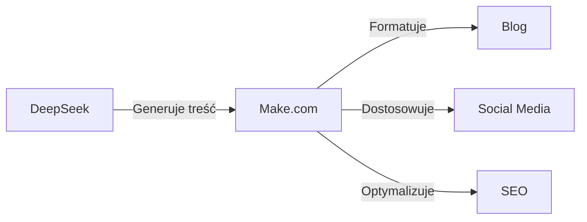

## Wstęp


Zanim SI dojrzeje na tyle by zabrać nam całą pracę, najpierw obdarzy tych z nas, którzy chcą się uczyć supermocami 


Używając odpowiednich narzędzi, pojedyncza osoba może osiągnąć to, co kiedyś wymagało całego zespołu! 


**Co zyskasz:**
- Automatyzację powtarzalnych zadań 
- Zwiększenie produktywności 
- Redukcję kosztów 


**Co potrzebujesz:**
- DeepSeek R1 - Niewielki koszt API
- Make.com - Plan Free na początek
- VSCode + Cline - Darmowe


W tym artykule pokażę, jak połączyć potęgę tych narzędzi, aby stworzyć swój własny ekosystem automatyzacji.


## DeepSeek: Wydajny asystent

### Co to jest DeepSeek?

DeepSeek to zaawansowany model AI, który 20 stycznia 2025 wydał przełomową wersję R1, rewolucjonizującą możliwości automatyzacji i programowania. DeepSeek-R1 oferuje:

- Wydajność dorównującą lub przewyższającą OpenAI-o1 w zadaniach rozumowania
- 671B parametrów (37B aktywnych) wykorzystujących architekturę MoE (Mixture of Experts)
- Wyjątkowe zdolności programistyczne (96.3 percentyl w Codeforces)
- Zaawansowane możliwości matematyczne (79.8% w AIME 2024, lepiej niż OpenAI o1-1217)
- W pełni open source'owy model z licencją MIT pozwalającą na komercyjne wykorzystanie

Co wyróżnia DeepSeek-R1 spośród innych modeli AI? Przede wszystkim jego zaawansowane zdolności rozumowania i analizy, które dorównują lub przewyższają zamknięte modele komercyjne. Model wykorzystuje najnowocześniejszą architekturę MoE, co pozwala na znacznie lepszą wydajność przy zachowaniu rozsądnych kosztów wdrożenia.
Oto poprawione zdanie do wklejenia:

```
Koszt użycia DeepSeek R1 to zaledwie $2.19 za milion tokenów 
wyjściowych, w porównaniu do $60 za milion tokenów w przypadku 
modelu o1.
```
### Zastosowania DeepSeek

1. **Generowanie kodu i treści**
   - Generowanie tekstów
   - Tworzenie kompletnych funkcji i modułów
   - Automatyczne generowanie testów jednostkowych
   - Refaktoryzacja istniejącego kodu

2. **Debugowanie i optymalizacja**
   - Analiza błędów w kodzie
   - Sugestie optymalizacji wydajności
   - Identyfikacja potencjalnych problemów bezpieczeństwa

3. **Dokumentacja i wyjaśnienia**
   - Automatyczne generowanie dokumentacji
   - Szczegółowe wyjaśnienia działania kodu
   - Tworzenie przykładów użycia

## Make.com: Centrum automatyzacji

### Podstawy Make.com

Make.com (wcześniej Integromat) to potężna platforma no-code do automatyzacji procesów. Oferuje:

- Intuicyjny interfejs drag-and-drop
- Ponad 1500 gotowych integracji
- Zaawansowane możliwości przetwarzania danych
- Integrację z narzędziami AI

### Kluczowe funkcje automatyzacji

1. **Przepływy pracy (Workflows)**
   - Wizualne tworzenie automatyzacji
   - Warunkowe wykonywanie zadań
   - Obsługa złożonych scenariuszy biznesowych

2. **Integracje z AI**
   - Połączenie z modelami językowymi
   - Automatyczne przetwarzanie tekstu i obrazów
   - Analiza sentymentu i klasyfikacja danych

3. **Zarządzanie danymi**
   - Automatyczna synchronizacja między systemami
   - Transformacja i walidacja danych
   - Tworzenie kopii zapasowych


### 1. System Publikacji Treści



**Implementacja:**
1. Wykorzystaj DeepSeek do generowania wstępnej treści
2. Skonfiguruj przepływ w Make.com:
   - Automatyczne formatowanie tekstu
   - Dodawanie obrazów i metadanych
   - Publikacja na różnych platformach
3. Monitoruj wyniki i dostosowuj proces

### 2. Automatyczne Tworzenie Stron i Aplikacji


Krok po kroku, od instalacji do działającej aplikacji z pełną automatyzacją.



**Pro tip:** Gdy masz problem z instalacją, zrozumieniem lub użyciem - zapytaj za darmo deepseek chat 


#### Krok 1: Konfiguracja środowiska


**Instalacja narzędzi** 

- Pobierz i zainstaluj Visual Studio Code
- Zainstaluj rozszerzenie Cline z marketplace


**Konfiguracja DeepSeek R1** 

1. Otwórz VSCode
2. Wciśnij Ctrl+Shift+P
3. Wpisz: Cline: Open Settings
4. Wybierz DeepSeek R1 jako model 
5. Wklej swój API code


#### Krok 2: Tworzenie strony internetowej

1. Utwórz nowy folder projektu w VSCode
2. W Cline napisz: "Stwórz responsywną stronę landing page dla firmy [opis]"
3. DeepSeek R1 wygeneruje strukturę plików:
   ```
   project/
   ├── index.html
   ├── styles.css
   ├── main.js
   └── assets/
   ```

#### Krok 3: Automatyzacja z Make.com

1. Utwórz nowy scenariusz w Make.com, który będzie działał jak automatyczny strażnik Twojego projektu:

   **Krok 1: Monitorowanie zmian** 🔍
   - Dodaj moduł "Watch Folder"
   - Wskaż folder Twojego projektu
   - Ustaw częstotliwość sprawdzania (np. co 15 minut)

   **Krok 2: Automatyczne wdrażanie** 🚀
   - Gdy pojawi się nowy lub zmodyfikowany plik
   - Make.com automatycznie przesyła zmiany na hosting
   - Możesz wybrać Netlify, Vercel lub GitHub Pages

   **Krok 3: Powiadomienia** 📱
   - Po udanym wdrożeniu
   - Wysyła wiadomość na Slack lub email
   - Zawiera informacje o wprowadzonych zmianach

💡 **Wskazówka:** Możesz dodać warunki, np. wdrażaj tylko gdy zmienił się plik HTML lub CSS

#### Krok 4: Rozwijanie funkcjonalności

1. W Cline możesz prosić o dodanie nowych funkcji:
   - "Dodaj formularz kontaktowy z walidacją"
   - "Zoptymalizuj wydajność strony"
   - "Dodaj animacje przy przewijaniu"


2. DeepSeek R1 wygeneruje odpowiedni kod, który możesz bezpośrednio wdrożyć. Do łatwiejszych zadań możesz przełączać w Cline na tańszy ale też bystry deepseek-chat.

#### Krok 5: Integracja z API

1. Użyj Make.com do połączenia z zewnętrznymi serwisami:
   - Bazy danych
   - Systemy płatności
   - Narzędzia analityczne

#### Wskazówki dla efektywnej pracy

- Używaj snippetów Cline do szybkiego generowania powtarzalnych elementów
- Pozwól DeepSeek R1 sugerować optymalizacje kodu
- Wykorzystaj Make.com do automatyzacji testów i wdrożeń

### Tworzenie Prostej Aplikacji Biznesowej

#### Krok 1: Przygotowanie aplikacji CRM w VSCode

1. Otwórz VSCode z rozszerzeniem Cline i użyj następującego promptu:
   ```
   "Stwórz prostą aplikację CRM z interfejsem webowym, która będzie zawierać:
   - Panel logowania
   - Bazę klientów
   - System notatek
   - Kalendarz spotkań
   Użyj HTML, JavaScript i Bootstrap dla frontendu."
   ```

2. DeepSeek R1 wygeneruje podstawową strukturę:
   ```
   crm-app/
   ├── index.html          # Strona logowania
   ├── dashboard.html      # Panel główny
   ├── clients.html        # Zarządzanie klientami
   ├── css/
   │   └── style.css      # Style aplikacji
   ├── js/
   │   ├── main.js        # Logika główna
   │   ├── auth.js        # Autentykacja
   │   └── api.js         # Integracje
   └── assets/            # Obrazy i ikony
   ```

#### Krok 2: Automatyzacja procesów w Make.com

1. Utwórz nowy scenariusz dla CRM:
   ```
   Trigger: "Nowy klient dodany"
   Akcje:
   1. Zapisz dane w Google Sheets
   2. Utwórz kontakt w Mailchimp
   3. Zaplanuj follow-up w kalendarzu
   4. Wyślij powiadomienie na Slack
   ```

#### Krok 3: Rozwijanie funkcjonalności z Cline

1. Dodawanie nowych funkcji przez prompty:
   ```
   "Dodaj system powiadomień email dla:
   - Nowych leadów
   - Zaplanowanych spotkań
   - Zadań przeterminowanych"
   ```

2. Integracja z zewnętrznymi API:
   ```
   "Zintegruj aplikację z:
   - API Kalendarza Google
   - Systemem mailingu
   - Bramką płatności"
   ```

#### Krok 4: Optymalizacja i wdrożenie

1. Użyj Make.com do automatyzacji:
   - Cykliczne kopie zapasowe danych
   - Automatyczne aktualizacje
   - Monitoring wydajności

2. Wykorzystaj DeepSeek R1 do optymalizacji:
   - Poprawy wydajności kodu
   - Implementacji zabezpieczeń
   - Dostosowania UI/UX

#### Wskazówki:

- Zacznij od małej funkcjonalności i stopniowo rozbudowuj
- Używaj Cline do szybkiego prototypowania
- Testuj każdą nową funkcję przed wdrożeniem
- Automatyzuj powtarzalne zadania przez Make.com

## Koszty i optymalizacja

### Miesięczne koszty przykładowego setup'u:

1. **DeepSeek**
   - Chat: $0
   - API: $5-20 w zależności od użycia

2. **Make.com**
   - Plan darmowy: 1000 operacji/miesiąc
   - Plan Basic: $9/miesiąc
   - Plan Pro: $16/miesiąc

3. **Dodatkowe darmowe narzędzia**
    - Hosting:
      * GitHub Pages (darmowy hosting stron statycznych)
      * Cloudflare Pages (darmowy plan z CI/CD)
      * Firebase Hosting (darmowy plan do 10GB/miesiąc)
      * Netlify (darmowy plan z 100GB transferu)
    - Przechowywanie danych:
      * GitHub (do 500MB na repozytorium)
      * Google Drive (15GB za darmo)
      * Firebase (darmowa baza danych do 1GB)
      * MongoDB Atlas (darmowy cluster do 512MB)

**Całkowity koszt miesięczny:** od $5 do $20 (zależnie od wybranego planu Make.com i uzywania API)

### Optymalizacja kosztów:

1. Wykorzystuj plany darmowe gdzie możliwe
2. Automatyzuj najbardziej czasochłonne zadania
3. Monitoruj zużycie i optymalizuj przepływy pracy

## Najlepsze praktyki

1. **Planowanie**
   - Zidentyfikuj powtarzalne zadania
   - Określ priorytety automatyzacji
   - Dokumentuj procesy

2. **Implementacja**
   - Zacznij od małych, prostych automatyzacji
   - Testuj dokładnie każdy element
   - Wprowadzaj stopniowe ulepszenia

3. **Monitorowanie**
   - Śledź efektywność automatyzacji
   - Zbieraj dane o błędach
   - Optymalizuj na podstawie wyników

## Podsumowanie


Połączenie DeepSeek, Make.com i innych narzędzi AI tworzy potężny ekosystem automatyzacji dostępny dla każdego.



Open Source  
Minimalne Koszty  
Pełna Automatyzacja 

System, który zbudujesz:

* Automatyzuje powtarzalne zadania 
* Zwiększa produktywność  
* Redukuje koszty operacyjne 
* Pozwala skupić się na strategicznych działaniach 

**Wskazówka:** Zacznij od małych automatyzacji i stopniowo rozbudowuj swój ekosystem.

## Przydatne linki

**Dokumentacja i zasoby:** 

- [DeepSeek R1 - Oficjalna dokumentacja](https://api-docs.deepseek.com/) 
- [DeepSeek R1 na HuggingFace](https://huggingface.co/deepseek-ai/DeepSeek-R1) 
- [Platforma Make.com](https://www.make.com/) 
- [Centrum AI Make.com](https://www.make.com/en/ai-automation) 

## Źródła


**Najnowsze artykuły i dokumentacja:**

1. [Oficjalna dokumentacja DeepSeek R1](https://api-docs.deepseek.com/news/news250120) 20 stycznia 2025
2. [Make.com - AI Automation Guide](https://www.make.com/en/ai-automation) 
3. [DeepSeek Research Paper](https://arxiv.org/abs/2401.14196) 
4. [Make.com Integration Guide](https://www.make.com/en/integrations) 
5. [DeepSeek-R1: Przełom w rozumowaniu AI](https://www.deeplearning.ai/the-batch/deepseek-r1-a-transparent-challenger-to-openai-o1/) styczeń 2025

