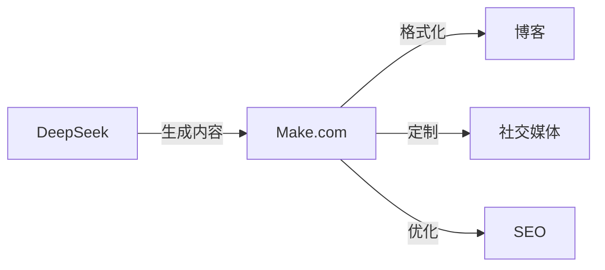

## 介绍

在AI成熟到足以取代我们所有工作之前，它将首先赋予我们这些想学习的人超能力 

使用正确的工具，一个人可以完成曾经需要一个团队才能完成的工作！


**你将获得：**
- 自动化重复任务 
- 提高生产力 
- 降低成本 

**你需要：**
- DeepSeek R1 - 低API成本
- Make.com - 免费计划开始
- VSCode + Cline - 免费

在本文中，我将向你展示如何结合这些工具的力量来创建你自己的自动化生态系统。

## DeepSeek：强大的助手

### 什么是DeepSeek？

DeepSeek是一种先进的AI模型，于2025年1月20日发布了突破性的R1版本，彻底改变了自动化和编程能力。DeepSeek-R1提供：

- 在推理任务中匹配或超越OpenAI-o1的性能
- 671B参数（37B活跃）利用MoE（专家混合）架构
- 出色的编程能力（Codeforces上96.3百分位）
- 高级数学能力（2024年AIME 79.8%，优于OpenAI o1-1217）
- 完全开源模型，MIT许可证允许商业使用

DeepSeek-R1与其他AI模型的不同之处是什么？主要是其先进的推理和分析能力，匹配或超越了封闭的商业模型。该模型使用最先进的MoE架构，在保持合理部署成本的同时显著提高了性能。

```
使用DeepSeek R1的成本仅为每百万输出token 2.19美元，
而o1模型为每百万token 60美元。
```

### DeepSeek应用

1. **代码和内容生成**
   - 文本生成
   - 完整函数和模块创建
   - 自动单元测试生成
   - 现有代码重构

2. **调试和优化**
   - 代码错误分析
   - 性能优化建议
   - 安全问题识别

3. **文档和解释**
   - 自动文档生成
   - 详细代码解释
   - 使用示例创建

## Make.com：自动化中心

### Make.com基础

Make.com（前身为Integromat）是一个强大的无代码流程自动化平台。它提供：

- 直观的拖放界面
- 超过1500个现成集成
- 高级数据处理能力
- AI工具集成

### 关键自动化功能

1. **工作流**
   - 可视化自动化创建
   - 条件任务执行
   - 复杂业务场景处理

2. **AI集成**
   - 与语言模型连接
   - 自动文本和图像处理
   - 情感分析和数据分类

3. **数据管理**
   - 自动系统同步
   - 数据转换和验证
   - 备份创建

### 1. 内容发布系统



**实现：**
1. 使用DeepSeek进行初始内容生成
2. 配置Make.com工作流：
   - 自动文本格式化
   - 添加图片和元数据
   - 发布到各个平台
3. 监控结果并调整流程

### 2. 自动网站和应用程序创建


一步一步，从安装到具有完整自动化的工作应用程序。



**专业提示：** 当你在安装、理解或使用方面遇到问题时 - 免费咨询deepseek聊天


#### 第一步：环境设置

**工具安装** 

- 下载并安装Visual Studio Code
- 从市场安装Cline扩展

**DeepSeek R1配置** 

1. 打开VSCode
2. 按Ctrl+Shift+P
3. 输入：Cline: 打开设置
4. 选择DeepSeek R1作为模型
5. 粘贴你的API代码

#### 第二步：网站创建

1. 在VSCode中创建新项目文件夹
2. 在Cline中输入："为[描述]公司创建一个响应式登陆页面"
3. DeepSeek R1将生成文件结构：
   ```
   project/
   ├── index.html
   ├── styles.css
   ├── main.js
   └── assets/
   ```

#### 第三步：使用Make.com自动化

1. 在Make.com中创建一个新场景，作为你项目的自动守护者：

   **第一步：更改监控** 🔍
   - 添加"监视文件夹"模块
   - 指向你的项目文件夹
   - 设置检查频率（例如每15分钟）

   **第二步：自动部署** 🚀
   - 当出现新的或修改的文件时
   - Make.com自动将更改推送到托管
   - 你可以选择Netlify、Vercel或GitHub Pages

   **第三步：通知** 📱
   - 成功部署后
   - 发送消息到Slack或电子邮件
   - 包括有关所做更改的信息

💡 **提示：** 你可以添加条件，例如仅在HTML或CSS文件更改时部署

#### 第四步：功能开发

1. 在Cline中你可以请求新功能：
   - "添加带验证的联系表单"
   - "优化页面性能"
   - "添加滚动动画"

2. DeepSeek R1将生成适当的代码，你可以直接部署。对于更简单的任务，你可以在Cline中切换到更便宜但同样智能的deepseek-chat。

#### 第五步：API集成

1. 使用Make.com连接外部服务：
   - 数据库
   - 支付系统
   - 分析工具

#### 有效工作技巧

- 使用Cline片段快速生成重复元素
- 让DeepSeek R1建议代码优化
- 使用Make.com进行测试和部署自动化

### 创建一个简单的商业应用程序

#### 第一步：在VSCode中准备CRM应用程序

1. 打开带有Cline扩展的VSCode并使用以下提示：
   ```
   "创建一个带有Web界面的简单CRM应用程序，包括：
   - 登录面板
   - 客户数据库
   - 笔记系统
   - 会议日历
   使用HTML、JavaScript和Bootstrap作为前端。"
   ```

2. DeepSeek R1将生成基本结构：
   ```
   crm-app/
   ├── index.html          # 登录页面
   ├── dashboard.html      # 主面板
   ├── clients.html        # 客户管理
   ├── css/
   │   └── style.css      # 应用程序样式
   ├── js/
   │   ├── main.js        # 主逻辑
   │   ├── auth.js        # 认证
   │   └── api.js         # 集成
   └── assets/            # 图片和图标
   ```

#### 第二步：在Make.com中流程自动化

1. 为CRM创建新场景：
   ```
   触发器："添加新客户"
   操作：
   1. 在Google Sheets中保存数据
   2. 在Mailchimp中创建联系人
   3. 在日历中安排跟进
   4. 发送Slack通知
   ```

#### 第三步：使用Cline开发功能

1. 通过提示添加新功能：
   ```
   "为以下内容添加电子邮件通知系统：
   - 新线索
   - 预定会议
   - 过期任务"
   ```

2. 外部API集成：
   ```
   "将应用程序与以下内容集成：
   - Google Calendar API
   - 邮件系统
   - 支付网关"
   ```

#### 第四步：优化和部署

1. 使用Make.com进行自动化：
   - 定期数据备份
   - 自动更新
   - 性能监控

2. 使用DeepSeek R1进行优化：
   - 代码性能改进
   - 安全实施
   - UI/UX调整

#### 提示：

- 从小功能开始，逐步构建
- 使用Cline进行快速原型设计
- 在部署前测试每个新功能
- 通过Make.com自动化重复任务

## 成本和优化

### 示例设置的每月成本：

1. **DeepSeek**
   - 聊天：$0
   - API：$5-20，取决于使用情况

2. **Make.com**
   - 免费计划：每月1000次操作
   - 基础计划：$9/月
   - 专业计划：$16/月

3. **其他免费工具**
    - 托管：
      * GitHub Pages（免费静态页面托管）
      * Cloudflare Pages（免费计划带CI/CD）
      * Firebase Hosting（免费计划高达10GB/月）
      * Netlify（免费计划带100GB传输）
    - 数据存储：
      * GitHub（每个仓库高达500MB）
      * Google Drive（15GB免费）
      * Firebase（免费数据库高达1GB）
      * MongoDB Atlas（免费集群高达512MB）

**每月总成本：** 从$5到$20（取决于选择的Make.com计划和API使用情况）

### 成本优化：

1. 尽可能使用免费计划
2. 自动化最耗时的任务
3. 监控使用情况并优化工作流

## 最佳实践

1. **规划**
   - 识别重复任务
   - 定义自动化优先级
   - 记录流程

2. **实施**
   - 从小而简单的自动化开始
   - 彻底测试每个元素
   - 逐步引入改进

3. **监控**
   - 跟踪自动化效果
   - 收集错误数据
   - 根据结果优化

## 总结


结合DeepSeek、Make.com和其他AI工具，创建了一个强大的自动化生态系统，人人都可以使用。



开源  
最低成本  
完全自动化 

你将构建的系统：

* 自动化重复任务 
* 提高生产力 
* 降低运营成本 
* 允许专注于战略行动 

**提示：** 从小型自动化开始，逐步构建你的生态系统。

## 有用链接

**文档和资源：** 

- [DeepSeek R1 - 官方文档](https://api-docs.deepseek.com/) 
- [DeepSeek R1 on HuggingFace](https://huggingface.co/deepseek-ai/DeepSeek-R1) 
- [Make.com 平台](https://www.make.com/) 
- [Make.com AI中心](https://www.make.com/en/ai-automation) 

## 来源


**最新文章和文档：**

1. [DeepSeek R1 官方文档](https://api-docs.deepseek.com/news/news250120) 2025年1月20日
2. [Make.com - AI自动化指南](https://www.make.com/en/ai-automation) 
3. [DeepSeek 研究论文](https://arxiv.org/abs/2401.14196) 
4. [Make.com 集成指南](https://www.make.com/en/integrations) 
5. [DeepSeek-R1：AI推理的突破](https://www.deeplearning.ai/the-batch/deepseek-r1-a-transparent-challenger-to-openai-o1/) 2025年1月
